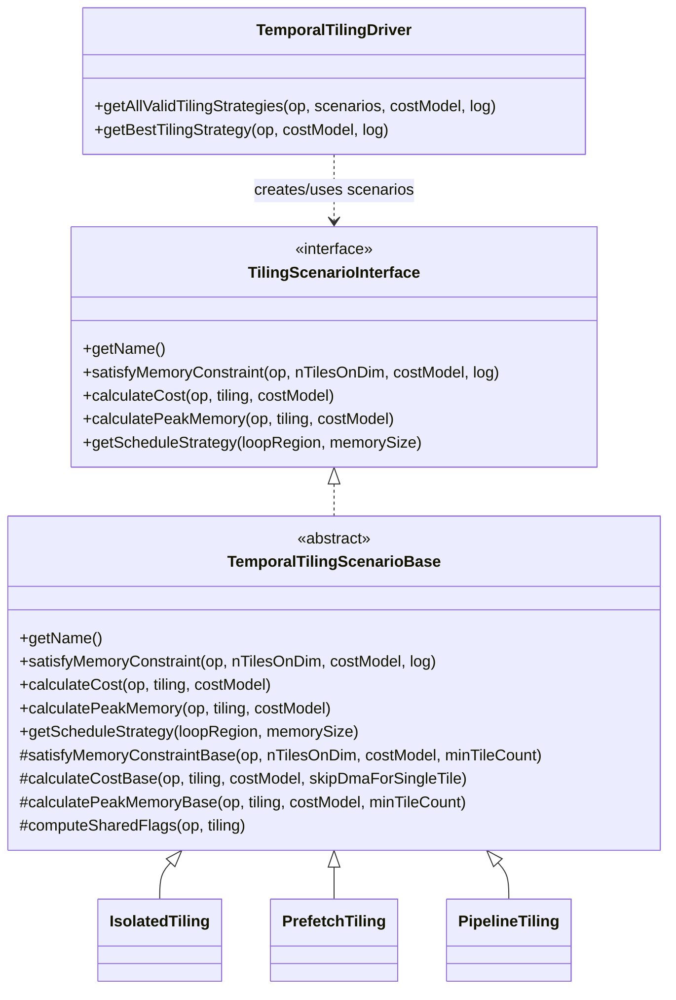
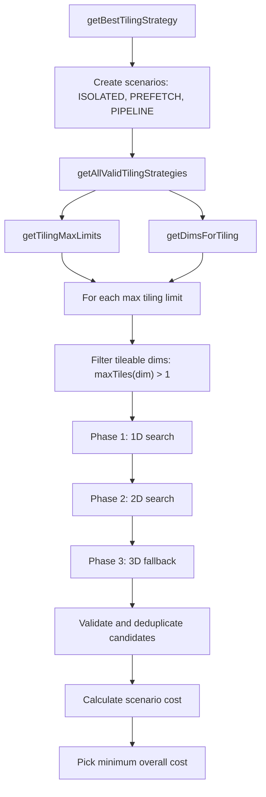

# Full Search Tiling Algorithm

## Scope

Full search tiling is enabled by the `enable-tiling-full-search-space` option. It searches temporal tiling candidates across three scenarios:

- `ISOLATED`
- `PREFETCH`
- `PIPELINE`

The current entry point is `TemporalTilingDriver::getBestTilingStrategy`. It supports operations that:

- implement `VPU::TilingBuilderOpInterface`
- have 4D or 5D output shape
- are not filtered out by `isCostInaccurate`

## Structure



`TemporalTilingDriver` owns the search flow. `TilingScenarioInterface` defines the interface for all the scenarios. `TemporalTilingScenarioBase` derives from `TilingScenarioInterface` and defines the shared base implementation for the tiling scenarios used by the search algorithm for memory feasibility, peak memory, scheduling, and cost evaluation.

## Temporal Tiling Scenarios

### TilingScenarioInterface

`TilingScenarioInterface` (`tiling_scenario_interface.hpp`) is the pure-virtual contract consumed by `generateLoopSchedules()` to produce a predefined loop schedule for a single compute region. In the current `IsolatedTiling`, `PrefetchTiling`, and `PipelineTiling` implementations, `getScheduleStrategy()` is still a placeholder that throws (not yet implemented). It defines five virtual methods:

| Method | Purpose |
|--------|---------|
| `getName()` | Returns a human-readable identifier (e.g. `"ISOLATED"`, `"PREFETCH"`, `"PIPELINE"`) |
| `satisfyMemoryConstraint(op, nTilesOnDim, costModel, log)` | Checks whether a tile count per dimension fits within CMX |
| `calculateCost(op, tiling, costModel)` | Estimates execution cost (DMA + compute + stall cycles) |
| `calculatePeakMemory(op, tiling, costModel)` | Computes peak CMX footprint for the given tiling |
| `getScheduleStrategy(loopRegion, memorySize)` | Determines the loop schedule for a compute region |

Implementations specialize cost/feasibility queries per scenario. For temporal tiling scenarios (used by the full search), all three concrete implementations inherit from `TemporalTilingScenarioBase`.

### TemporalTilingScenarioBase

`TemporalTilingScenarioBase` (`temporal_tiling_scenario_base.hpp/.cpp`) provides the shared logic for all three temporal tiling scenarios. The concrete scenarios override specific virtual methods to model their distinct DMA/compute overlap and memory layout behaviors.

#### Shared Base Methods

**`satisfyMemoryConstraintBase(op, nTilesOnDim, costModel, minTileCount)`**

1. Divides the output shape into tiles via `fillDividedTiles`.
2. Returns `false` if tile division fails or produces fewer tiles than `minTileCount`.
3. Calls `calculatePeakMemory()` (dispatched to the concrete scenario).
4. Compares peak memory against total CMX size — returns `true` only if it fits.

**`calculateCostBase(op, tiling, costModel, skipDmaForSingleTile)`**

Computes aggregate scheduling cost across all tiles:

1. Obtains per-tile cost vectors from the cost model: `{actCosts, weightsCosts, computeCosts, outputCosts}`.
2. Determines shared-buffer flags via `computeSharedFlags()`.
3. For each tile, back-infers input tiles and classifies costs:
   - **Shared operands** (same data across tiles): treated as **stall cost** — blocks all FIFOs.
   - **Non-shared operands** (different data per tile): treated as **DMA-in cost** — pipelineable.
   - Uses an `aliveOperandOffset` map to skip DMA costs when a buffer's offset hasn't changed since the previous tile (i.e. the buffer is already in CMX).
4. Calls `computeTileOverallCost()` (dispatched to the concrete scenario) to combine per-tile cost components according to the scenario's DMA/compute overlap model.
5. Sums tile-level costs into `{totalDmaCost, totalComputeCost, totalOverallCost, efficiency}`.

**`calculatePeakMemoryBase(op, tiling, costModel, minTileCount)`**

Computes worst-case peak CMX footprint:

1. Determines shared-buffer flags via `computeSharedFlags()`.
2. For each tile (up to `PEAK_MEMORY_NUM_TILES_SEARCH_HEURISTIC`):
   - Retrieves tiled operand types with distribution from the cost model.
   - Aligns buffer sizes for swizzling.
   - Calls `classifyOperandSize()` (dispatched to the concrete scenario) to bucket each operand into `PeakMemorySizeBuckets{shared, individual, prefetch}`.
   - Adds weight table and sparsity map sizes with appropriate sharing classification.
   - Calls `computeTilePeakMemory()` (dispatched to the concrete scenario) to compute the tile's peak.
3. Returns the maximum peak across all examined tiles.

**`computeSharedFlags(op, tiling)`**

Determines whether the first and second input operands are reused (shared) across tiles by comparing back-inferred input offsets between tile 0 and tile 1. An operand is "shared" if its offsets don't change between consecutive tiles, meaning it stays resident in CMX:

1. Back-infer input tiles for output tile 0 and tile 1 via `backInferTileInfo`.
2. Compare the offsets of each input operand across the two tiles.
3. If offsets are identical, the operand is shared (constant across tiles).

The algorithm compares only the first two tiles at the moment (TODO E#220578, to make operands sharing logic generic).

Note: although the flags are called `isActivationShared` and `isWeightShared`, they actually indicate whether the first and second input operands are shared, regardless of their actual role. The naming is kept for clarity for the most common op cases.

Returns `{isActivationShared, isWeightShared}`.

**Note on 2D tiling:** For nested tiling, the output tiles are linearized in the order produced by `fillDividedTiles()`, where the inner-loop dimension changes between the first two tiles. `computeSharedFlags()` therefore compares only tile 0 and tile 1 to identify which input operand stays constant across the inner loop. When the outer-loop dimension advances, an operand that was “shared” across the inner loop may still need to be reloaded; this is handled in `calculateCostBase()` by tracking aliveOperandOffset and adding DMA/stall cost whenever the back-inferred input offset changes. For peak-memory estimation this distinction does not require extra double-buffering: shared operands are kept in the shared bucket, while non-shared operands are treated as per-tile/prefetchable according to the selected scenario. If the first two tiles already cross an outer-loop boundary, the flags may mark both operands as non-shared, which is conservative.

#### CostInfo Return Type

All `calculateCost()` methods return `CostInfo`:

```cpp
struct CostInfo {
    uint64_t dmaCost = 0;
    uint64_t computeCost = 0;
    uint64_t overallCost = 0;   // scenario-specific combination
    double efficiency = 0;       // DPU utilization ratio (convolutions only)
};
```

`overallCost` is the value used by `TemporalTilingDriver` for candidate ranking.
Currently, `efficiency` is set to `-1.0` when not applicable/available (e.g. non-convolution ops or zero compute cost); in the future it can also be used for candidate ranking for Performance vs Power tradeoffs.

#### PeakMemorySizeBuckets

Memory classification used during peak memory estimation:

```cpp
struct PeakMemorySizeBuckets {
    Byte shared = Byte(0);       // buffers reused across tiles
    Byte individual = Byte(0);   // buffers unique to each tile
    Byte prefetch = Byte(0);     // prefetched next-tile inputs (PREFETCH only)
};
```

### IsolatedTiling

The most conservative scenario. Each tile is processed sequentially: DMA-in, compute, and DMA-out must complete for one tile before the next tile begins.

#### Cost Formula

All four cost components are simply summed for every tile:

```
tileCost = stallCost + dmaInCost + computeCost + dmaOutCost
```

No overlap between DMA and compute. `skipDmaForSingleTile = true` — for single-tile configurations, activation and output DMA costs are assumed zero (no spill)

#### Memory Model

Peak CMX = one tile's individual buffers + shared buffers. No double-buffering.

```
peakMemory = individual + shared
```

```
┌─────────────────────────────────────────────────────────────────────────┐
│ CMX Memory Layout (during tile N)                                       │
│                                                                         │
│  ├─── input tile N ───┼─── output tile N ───┤── shared ──┤              │
└─────────────────────────────────────────────────────────────────────────┘
```

Operand classification:
- Shared activation (operand 0, activation shared) -> `buckets.shared`
- Shared weight (operand 1, weight shared) -> `buckets.shared`
- All other operands -> `buckets.individual`

#### Minimum Tile Count

`minTileCount = 1` — accepts single-tile configurations (the untiled case).

#### Execution Timeline

```
Time ─────────────────────────────────────────────────────────────────────────────────────────>

SHARED:  |==IN[SHRD]==|----------------------------shared buffer lifetime------------------->
DMA_IN:               |==IN[0]==|                             |==IN[1]==|
Compute:                        |====COMPUTE[0]====|                     |====COMPUTE[1]====|
DMA_OUT:                                           |==OUT[0]==|                             |==OUT[1]==|

         ├───────────────────── tile 0 ───────────────────────┤──────────────── tile 1 ──────┤
```

Each tile must fully complete before the next starts. DMA and compute engines are idle while the other works.

### PrefetchTiling

Overlaps the DMA-in for the next tile with the compute of the current tile. While the DPU/SHAVE processes tile N, the DMA engine fetches inputs for tile N+1 into CMX. DMA-out remains serialized after compute.

#### Cost Formula

```
first tile:  tileCost = stallCost + dmaInCost + computeCost + dmaOutCost
other tiles: tileCost = stallCost + max(dmaInCost, computeCost) + dmaOutCost
```

For non-first tiles, DMA-in and compute overlap — the longer one dominates.

#### Memory Model

Peak CMX = current tile (individual) + prefetched next-tile inputs + shared buffers.

```
peakMemory = individual + shared + prefetch
```

```
┌─────────────────────────────────────────────────────────────────────────────┐
│ CMX Memory Layout (during compute of tile N)                                │
│                                                                             │
│  ├── input[N] ──┼── output[N] ──┼── prefetch input[N+1] ──┼── shared ──┤    │
└─────────────────────────────────────────────────────────────────────────────┘
```

Operand classification:
- Shared activation (operand 0, activation shared) -> `buckets.shared`
- Shared weight (operand 1, weight shared) -> `buckets.shared`
- Non-shared input operands (not the last/output operand) -> `buckets.prefetch` + `buckets.individual`
- Output operand -> `buckets.individual`

Non-shared inputs are counted in both `prefetch` and `individual` because the current tile's inputs and the next tile's prefetched inputs coexist in CMX.

#### Minimum Tile Count

`minTileCount = 2` — prefetching requires at least two tiles.

#### Execution Timeline

```
Time ─────────────────────────────────────────────────────────────────────────────────────────>

SHARED:  |==IN[SHRD]==|----------------------------shared buffer lifetime------------------->
DMA_IN:               |==IN[0]==|==IN[1]==|                   |==IN[2]==|
Compute:                        |====COMPUTE[0]====|          |====COMPUTE[1]====|
DMA_OUT:                                           |==OUT[0]==|                  |==OUT[1]==|

                                 IN[1] prefetched while COMPUTE[0] runs
```

DMA-in latency is hidden behind compute when `computeCost >= dmaInCost`. If `dmaInCost > computeCost`, compute finishes earlier and waits.

### PipelineTiling

Full double-buffering: overlaps DMA-in, compute, and DMA-out across different tiles simultaneously. At steady state, three consecutive tiles are in-flight: one being loaded, one being computed, one being stored.

#### Cost Formula

```
first tile: tileCost = stallCost + dmaInCost + max(computeCost, dmaOutCost)
mid tiles:  tileCost = stallCost + max(dmaInCost, computeCost, dmaOutCost)
last tile:  tileCost = stallCost + max(dmaInCost, computeCost) + dmaOutCost
```

At steady state (mid tiles), the three tasks run in parallel and the slowest one dominates. An assertion enforces that a tile cannot be both first and last (i.e. `minTileCount >= 2`).

#### Memory Model

Peak CMX = 2 × individual tile buffers (ping-pong) + shared buffers. Non-shared buffers are doubled because while one slot is used by compute, the other is being filled/drained by DMA.

```
peakMemory = individual × 2 + shared
```

```
┌─────────────────────────────────────────────────────────────────────────────┐
│ CMX Memory Layout (steady state)                                            │
│                                                                             │
│  ├───── Slot A (tile N) ─────┼───── Slot B (tile N+1) ─────┼── shared ──┤   │
│  │ input[N] + output[N]      │ input[N+1] + output[N+1]    │   wt/act   │   │
└─────────────────────────────────────────────────────────────────────────────┘
```

Operand classification:
- Shared activation (operand 0, activation shared) -> `buckets.shared`
- Shared weight (operand 1, weight shared) -> `buckets.shared`
- All other operands -> `buckets.individual` (doubled in `computeTilePeakMemory`)

#### Minimum Tile Count

`minTileCount = 2` — double-buffering requires at least two tiles.

#### Execution Timeline

```
Time ────────────────────────────────────────────────────────────────────────────────────────>

SHARED:  |==IN[SHRD]==|----------------------------shared buffer lifetime------------------->
DMA_IN:               |==IN[0]==|==IN[1]==|  |==IN[2]==|  |==IN[3]==|  |==IN[4]==|
Compute:                        |===CMP[0]===|===CMP[1]===|===CMP[2]===|===CMP[3]===|===CMP[4]===|
DMA_OUT:                                     |==OUT[0]==| |==OUT[1]==| |==OUT[2]==| |==OUT[3]==| |==OUT[4]==|

                                 IN[2], CMP[1], OUT[0] all execute concurrently
```

Pipeline phases:
- **Ramp-up**: Only DMA\_IN\[0\], then DMA\_IN\[1\] + CMP\[0\] overlap.
- **Steady-state**: DMA\_IN\[N+2\] + CMP\[N+1\] + DMA\_OUT\[N\] run in parallel.
- **Ramp-down**: Last compute + last DMA\_OUT drain.

Ping-pong memory usage: even iterations use Slot A, odd iterations use Slot B. Shared buffers exist in a single copy.

### Scenario Comparison Summary

| Aspect | IsolatedTiling | PrefetchTiling | PipelineTiling |
|--------|---------------|----------------|----------------|
| **DMA/Compute overlap** | None | DMA-in overlaps compute | DMA-in, compute, DMA-out all overlap |
| **Min tile count** | 1 | 2 | 2 |
| **CMX pressure** | Lowest (1× individual + shared) | Medium (1× individual + 1× prefetch + shared) | Highest (2× individual + shared) |
| **Throughput** | Lowest | Medium | Highest (when balanced) |
| **Cost formula (steady)** | Sum of all components | `stall + max(dmaIn, compute) + dmaOut` | `stall + max(dmaIn, compute, dmaOut)` |

## Temporal Tiling Driver

### Key Files

- `temporal_tiling_driver.cpp`: core search algorithm and best-strategy selection.
- `temporal_tiling_utils.cpp`: temporal tiling policy helpers, including dimension order, forbidden dimensions, multi-cluster adjustment, and max tiling limits.
- `tiling_scenario_interface.hpp`: common scenario interface.
- `temporal_tiling_scenario_base.hpp`: base implementation for temporal tiling scenarios.
- `isolated_tiling.hpp`, `prefetch_tiling.hpp`, `pipeline_tiling.hpp`: concrete temporal scenarios.
- `core/tiling.cpp`: shared tiling helpers reused by temporal full search and legacy tiling.

### Search Flow



### Search Order

The algorithm is organized as:

1. Iterate over max tiling limits from `getTilingMaxLimits`.
2. Build tileable dimensions from `getDimsForTiling`, keeping only dimensions with `maxTiles[dim] > 1`.
3. Phase 1: search each single dimension from `minNumTiles[dim]` to `maxNumTiles[dim]`.
4. Phase 2: set one primary dimension to its max valid value, then search a secondary dimension.
5. Phase 3: only if no valid strategy was found, set two dimensions to max valid values, then search a third dimension.
6. Score all valid candidates and choose the lowest `overallCost`.

For one searched dimension, `findTileOptionsForDim` walks the inclusive range `[minTiles, maxTiles]` once. It partitions candidates by scenario:

1. Advance until the current scenario satisfies its memory constraint.
2. Record candidates for that scenario until the next scenario becomes feasible.
3. For the last scenario, stop when further tiling is considered inefficient, currently when
    `TemporalTilingSearchSpaceConfig::lastScenarioSearchStopPredicate` returns true.

### Search Range

Full-search knobs are collected in `TemporalTilingSearchSpaceConfig`:

- NCE target spatial tile sizes
- NCE target channel tile sizes
- the last-scenario stop predicate and its default memory usage cutoff used to stop inefficient over-tiling

The lower bound comes from `getMinNumTiles`, mainly to satisfy dimension limits for NCE ops.

The upper bound comes from `getTilingMaxLimits` and `TemporalTilingSearchSpaceConfig`:

- NCE ops use target spatial tile sizes `{4, 8, 16}` and target channel sizes `{16, 32, 64}`.
- Op-specific alignment is applied through `updateTilingSizeForOpAlignment`.
- Multi-cluster strategy tightens the corresponding split dimension:
  - SOH/SOH-overlapped: height
  - SOW: width
  - SOK: channel
  - SOG: group
- For H/W, both floor and ceil max-limit variants can be generated.

### Dimension Policy

`getDimsForTiling` provides the temporal full-search dimension order:

- `NCEConvolutionOp` and `NCECompressConvolutionOp` use temporal-specific shape-based ordering.
- Other ops start from the output layout permutation.
- `removeForbiddenDims` then filters unsupported dimensions per op type.

Current op-specific filters include:

- `NCEDepthConvolutionOp`, `NCEMaxPoolOp`, `NCEAveragePoolOp`, `NCEEltwiseOp`: remove N and remove C when autopad changes channel size.
- `NCEPermuteOp`, `NCEConvolutionOp`: C/H/W only.

### Validation and Constraints

Each candidate is accepted only if:

- `fillDividedTiles` succeeds and returns non-empty tiling.
- It is not a duplicate under the same scenario.
- Non-`ISOLATED` scenarios actually tile at least one dimension.
- No tile exceeds `VPU_DIMENSION_LIMIT`.
- NCE tiles satisfy workload channel constraints.
- Multi-cluster compatibility checks pass, including channel divisibility where required.
- The selected scenario satisfies its CMX memory constraint.

### Cost Selection

For every valid candidate:

1. `fillDividedTiles` materializes output tiles.
2. The corresponding `TemporalTilingScenarioBase` implementation calculates cost.
3. `TemporalTilingDriver` selects the candidate with the minimum `overallCost`.

The result is cached by op hash. If the op has a multi-cluster strategy, the hash also includes the strategy and output distribution mode to avoid collisions between different distribution choices.
