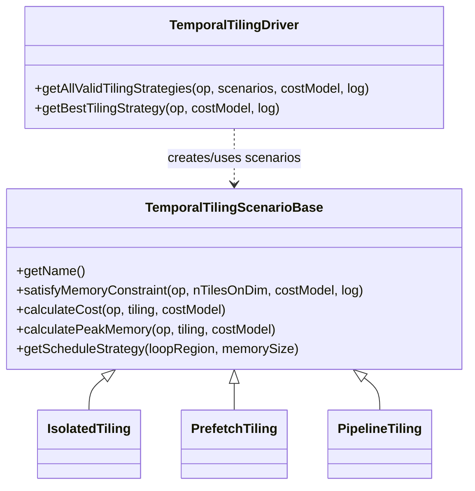
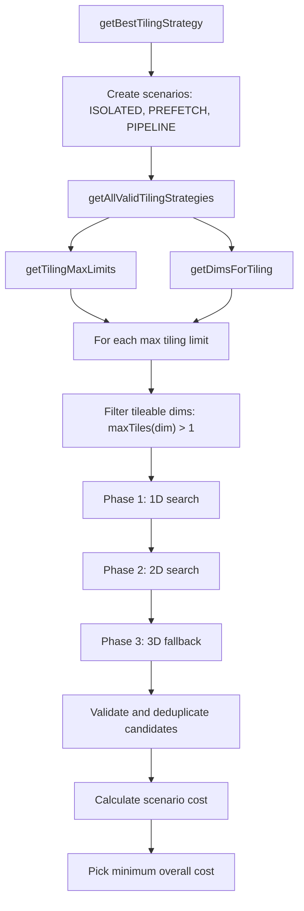

# Full Search Tiling Algorithm

## Scope

Full search tiling is enabled by the `enable-tiling-full-search-space` option. It searches temporal tiling candidates across three scenarios:

- `ISOLATED`
- `PREFETCH`
- `PIPELINE`

The current entry point is `TemporalTilingDriver::getBestTilingStrategy`. It supports operations that:

- implement `VPU::TilingBuilderOpInterface`
- have 4D or 5D output shape
- are not filtered out by `isCostInaccurate`

## Structure

`TemporalTilingDriver` owns the search flow. `TemporalTilingScenarioBase` defines the scenario interface used by the search algorithm for memory feasibility, peak memory, scheduling, and cost evaluation.

[E#215820] TODO: document the detailed implementation of `TemporalTilingScenarioBase`, `IsolatedTiling`, `PrefetchTiling`, and `PipelineTiling`.

## Key Files

- `temporal_tiling_driver.cpp`: core search algorithm and best-strategy selection.
- `temporal_tiling_utils.cpp`: temporal tiling policy helpers, including dimension order, forbidden dimensions, multi-cluster adjustment, and max tiling limits.
- `temporal_tiling_scenario_base.hpp`: common scenario interface.
- `isolated_tiling.hpp`, `prefetch_tiling.hpp`, `pipeline_tiling.hpp`: concrete temporal scenarios.
- `core/tiling.cpp`: shared tiling helpers reused by temporal full search and legacy tiling.

## Search Flow

## Search Order

The algorithm is organized as:

1. Iterate over max tiling limits from `getTilingMaxLimits`.
2. Build tileable dimensions from `getDimsForTiling`, keeping only dimensions with `maxTiles[dim] > 1`.
3. Phase 1: search each single dimension from `minNumTiles[dim]` to `maxNumTiles[dim]`.
4. Phase 2: set one primary dimension to its max valid value, then search a secondary dimension.
5. Phase 3: only if no valid strategy was found, set two dimensions to max valid values, then search a third dimension.
6. Score all valid candidates and choose the lowest `overallCost`.

For one searched dimension, `findTileOptionsForDim` walks the inclusive range `[minTiles, maxTiles]` once. It partitions candidates by scenario:

1. Advance until the current scenario satisfies its memory constraint.
2. Record candidates for that scenario until the next scenario becomes feasible.
3. For the last scenario, stop when further tiling is considered inefficient, currently when
    `TemporalTilingSearchSpaceConfig::lastScenarioSearchStopPredicate` returns true.

## Search Range

Full-search knobs are collected in `TemporalTilingSearchSpaceConfig`:

- NCE target spatial tile sizes
- NCE target channel tile sizes
- the last-scenario stop predicate and its default memory usage cutoff used to stop inefficient over-tiling

The lower bound comes from `getMinNumTiles`, mainly to satisfy dimension limits for NCE ops.

The upper bound comes from `getTilingMaxLimits` and `TemporalTilingSearchSpaceConfig`:

- NCE ops use target spatial tile sizes `{4, 8, 16}` and target channel sizes `{16, 32, 64}`.
- Op-specific alignment is applied through `updateTilingSizeForOpAlignment`.
- Multi-cluster strategy tightens the corresponding split dimension:
  - SOH/SOH-overlapped: height
  - SOW: width
  - SOK: channel
  - SOG: group
- For H/W, both floor and ceil max-limit variants can be generated.

## Dimension Policy

`getDimsForTiling` provides the temporal full-search dimension order:

- `NCEConvolutionOp` and `NCECompressConvolutionOp` use temporal-specific shape-based ordering.
- Other ops start from the output layout permutation.
- `removeForbiddenDims` then filters unsupported dimensions per op type.

Current op-specific filters include:

- `NCEDepthConvolutionOp`, `NCEMaxPoolOp`, `NCEAveragePoolOp`, `NCEEltwiseOp`: remove N and remove C when autopad changes channel size.
- `NCEPermuteOp`, `NCEConvolutionOp`: C/H/W only.

## Validation and Constraints

Each candidate is accepted only if:

- `fillDividedTiles` succeeds and returns non-empty tiling.
- It is not a duplicate under the same scenario.
- Non-`ISOLATED` scenarios actually tile at least one dimension.
- No tile exceeds `VPU_DIMENSION_LIMIT`.
- NCE tiles satisfy workload channel constraints.
- Multi-cluster compatibility checks pass, including channel divisibility where required.
- The selected scenario satisfies its CMX memory constraint.

## Cost Selection

For every valid candidate:

1. `fillDividedTiles` materializes output tiles.
2. The corresponding `TemporalTilingScenarioBase` implementation calculates cost.
3. `TemporalTilingDriver` selects the candidate with the minimum `overallCost`.

The result is cached by op hash. If the op has a multi-cluster strategy, the hash also includes the strategy and output distribution mode to avoid collisions between different distribution choices.
